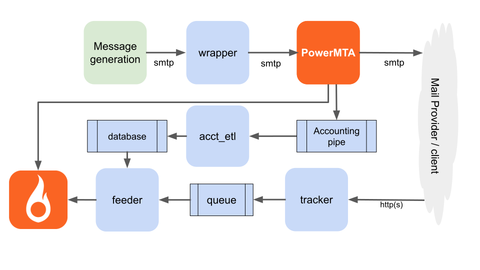

<a href="https://www.sparkpost.com"></a>

[Sign up](https://app.sparkpost.com/join?plan=free-0817?src=Social%20Media&sfdcid=70160000000pqBb&pc=GitHubSignUp&utm_source=github&utm_medium=social-media&utm_campaign=github&utm_content=sign-up) for a SparkPost account and visit our [Developer Hub](https://developers.sparkpost.com) for even more content.

# sparkypmtatracking
[](https://travis-ci.org/tuck1s/sparkypmtatracking)
[](https://coveralls.io/github/tuck1s/sparkypmtatracking?branch=master)

Open and click tracking modules for PMTA and SparkPost Signals:



|app (link)|description|
|---|---|
|[feeder](#feeder)|Takes open & click events, adds message attributes from Redis where found, and feeds them to the SparkPost Signals [Ingest API](https://developers.sparkpost.com/api/events-ingest/)|
|[tracker](#tracker)|Web service that decodes client email opens and clicks|
|[acct_etl](#acct_etl)|Extract, transform, load piped PMTA custom accounting stream message attributes into Redis|
|[wrapper](#wrapper)|SMTP proxy service that adds engagement information to email
|[linktool](#linktool)|Command-line tool to encode and decode link URLs|

## Pre-requisites
- Git & Golang - installation tips [here](#installing-git-golang-on-your-host)
- Redis - installation tips [here](#installing-redis-on-your-host)
- NGINX - installation tips [here](#installing-and-configuring-nginx-proxy)

Build instructions [here](#build).

## feeder
The feeder task reads events from the Redis queue in an internal format, and feeds them to the SparkPost Ingest API, with additional attributes from the local database where found.

```
./feeder -h
Takes the opens and clicks from the Redis queue and feeds them to the SparkPost Ingest API
Requires environment variable SPARKPOST_API_KEY_INGEST and optionally SPARKPOST_HOST_INGEST
Usage of ./feeder:
  -logfile string
        File written with message logs
```

If you omit `-logfile`, output will go to the console (stdout).
The SparkPost ingest API key (and optionally, the host base URL) is passed in environment variables:

```
export SPARKPOST_API_KEY_INGEST=###your API key here##
export SPARKPOST_HOST_INGEST=api.sparkpost.com
```

You’ll typically want to run this as a background process on startup - see the project cronfile and start.sh for examples of how to do that.

The logfile shows number of events, GZipped upload size, Ingest API response and Batch ID.

```
2020/01/07 16:00:44 Uploaded 82559 bytes raw, 4881 bytes gzipped. SparkPost Ingest response: 200 OK, results.id=deea5e3e-7e03-4b3c-831b-1b2851190db1
2020/01/07 16:10:41 Uploaded 84612 bytes raw, 5104 bytes gzipped. SparkPost Ingest response: 200 OK, results.id=a567ec74-c1e0-4546-86bd-dbd838315e71
2020/01/07 16:20:41 Uploaded 31974 bytes raw, 2265 bytes gzipped. SparkPost Ingest response: 200 OK, results.id=36e9b2d7-ea54-4fc5-8ed0-7f5696623464
``` 

## tracker
The tracker task runs a web service that decodes client email opens and clicks, provides http responses, and queues events for the feeder task.

```
 ./tracker -h
Web service that decodes client email opens and clicks
Runs in plain mode, it should proxied (e.g. by nginx) to provide https and protection.
Usage of ./tracker:
  -in_hostport string
        host:port to serve incoming HTTP requests (default ":8888")
  -logfile string
        File written with message logs
```

If you omit `-logfile`, output will go to the console (stdout).

The logfile records the action (open/click), target URL, datetime, user_agent, and remote (client) IP address:

```log
2020/01/09 15:40:27 Timestamp 1578584427, IPAddress 127.0.0.1, UserAgent Mozilla/5.0 (Linux; Android 4.4.2; XMP-6250 Build/HAWK) AppleWebKit/537.36 (KHTML, like Gecko) Version/4.0 Chrome/30.0.0.0 Safari/537.36 ADAPI/2.0 (UUID:9e7df0ed-2a5c-4a19-bec7-2cc54800f99d) RK3188-ADAPI/1.2.84.533 (MODEL:XMP-6250), Action c, URL http://example.com/index.html, MsgID 00006449175e39c767c2
2020/01/09 15:40:27 Timestamp 1578584427, IPAddress 127.0.0.1, UserAgent Mozilla/5.0 (X11; Linux x86_64) AppleWebKit/537.36 (KHTML, like Gecko) Chrome/44.0.2403.157 Safari/537.36, Action o, URL , MsgID 00006449175eea2bd529
```

You can test your service endpoint locally using `curl` to a link address, such as 

```
curl -v http://localhost:8888/eJxUzLEOQiEMRuF3-WciGAaTTr4JwbaIUSKBMhnf_Ybxnv18P2Q2EBgOltb4gFDN-iTvraotfs8Lfxsc2nyml4AQdqJZHqqlhCDXGG9wGNw3VYbK_fT-jwAAAP__f2Mg1g==
```

You should see response headers such as
```
< HTTP/1.1 302 Found
< Content-Type: text/plain
< Location: https://thetucks.com
< Server: msys-http
```

You can make your own test link addresses using [linktool](#linktool).

### Tracker internals
The tracker web service receives URL requests with the path carrying base64-encoded (URL safe), Zlib-compressed, minified JSON.

Each event is augmented with:
- event type (open, initial_open, click)
- user agent
- timestamp (time of opening / clicking)
- client IP address

and sent to the Redis queue for the feeder task (using `RPUSH`).

It's usual to deploy a proxy such as `NGINX` in front of this service; more [here](#NGINX).

## acct_etl
Extracts, transforms and loads accounting data fed by [PowerMTA pipe](https://download.port25.com/files/UsersGuide.html#examples) into Redis.

```
 ./acct_etl -h
Extracts, transforms and loads accounting data fed by PowerMTA pipe into Redis
Usage of ./acct_etl:
  -infile string
        Input file (omit to read from stdin)
  -logfile string
        File written with message logs
```

Here is an example [PowerMTA config file](etc/pmta/config.example) showing "accounting pipe" setup. The pipe carries message attributes that "feeder" uses to augment the open and click event data.

|PowerMTA accounting file config|SparkPost term / project usage|
|--|--|
|type|d=delivery|
|rcpt|Recipient (`To:` address)|
|header_x-sp-message-id|Message ID (added by `wrapper`)|
|header_x-sp-subaccount-id|Optional subaccount ID. Place in injected message if you wish to use|

### acct_etl internals
You can test without PowerMTA using the included example file:
```
./acct_etl -infile example.csv
```

```log
Starting acct_etl, logging to
2020/01/10 19:02:32 PowerMTA accounting headers: [type rcpt header_x-sp-message-id header_x-sp-subaccount-id]
2020/01/10 19:02:32 Loaded acct_headers -> {"header_x-sp-message-id":2,"header_x-sp-subaccount-id":3,"rcpt":1,"type":0} into Redis
2020/01/10 19:02:32 Loaded msgID_0000123456789abcdef0 -> {"header_x-sp-subaccount-id":"0","rcpt":"test+00102830@not-orange.fr.bouncy-sink.trymsys.net"} into Redis
2020/01/10 19:02:32 Loaded msgID_0000123456789abcdef1 -> {"header_x-sp-subaccount-id":"1","rcpt":"test+00113980@not-orange.fr.bouncy-sink.trymsys.net"} into Redis
2020/01/10 19:02:32 Loaded msgID_0000123456789abcdef2 -> {"header_x-sp-subaccount-id":"2","rcpt":"test+00183623@not-orange.fr.bouncy-sink.trymsys.net"} into Redis
```

The `start.sh` file copies the `acct_etl` executable to a place where PowerMTA runs it, and sets owner. It temporarily stops and restarts PowerMTA.

Logfile default location for this process is `/opt/pmta/acct_etl.log`.

Redis key/value pairs hold data for each message ID, with a configured time-to-live (matching SparkPost's event retention).
You can list these keys with `redis-cli keys msgID*`.

## wrapper
This is an SMTP proxy service that accepts incoming messages from your downstream client, applies engagement-tracking (wrapping links and adding open tracking pixels) and relays on to an upstream server.

TLS with your own local certificate/private key is supported.

```
SMTP proxy that accepts incoming messages from your downstream client, applies engagement-tracking
(wrapping links and adding open tracking pixels) and relays on to an upstream server.
Usage of ./wrapper:
  -certfile string
    	Certificate file for this server
  -downstream_debug string
    	File to write downstream server SMTP conversation for debugging
  -in_hostport string
    	Port number to serve incoming SMTP requests (default "localhost:587")
  -insecure_skip_verify
    	Skip check of peer cert on upstream side
  -logfile string
    	File written with message logs (also to stdout)
  -out_hostport string
    	host:port for onward routing of SMTP requests (default "smtp.sparkpostmail.com:587")
  -privkeyfile string
    	Private key file for this server
  -track_click
    	Wrap links in HTML mail, to track clicks
  -track_initial_open
    	Insert an initial_open tracking pixel at top of HTML mail
  -track_open
    	Insert an open tracking pixel at bottom of HTML mail (default true)
  -tracking_url string
    	URL of your tracking service endpoint (default "http://localhost:8888")
  -upstream_data_debug string
    	File to write upstream DATA for debugging
  -verbose
    	print out lots of messages
```

Example setup that will:
- Receive downstream client connections on localhost port 5587
- Forward emails to an upstream PowerMTA server on port 587
- Offer its own TLS using the supplied certificates
- Log activity to a file
- All tracking options enabled.

```bash
./wrapper -in_hostport :5587 -out_hostport pmta.signalsdemo.trymsys.net:587 \
 -privkeyfile privkey.pem -certfile fullchain.pem \
 -logfile wrapper.log \
 -tracking_url http://pmta.signalsdemo.trymsys.net \
 -track_open -track_initial_open -track_click
```

Each phase of the SMTP conversation, including STARTTLS connection negotiation with the upstream server, proceeds in step with your downstream client requests.

```
Client      Proxy       Server
       -> 
                   ->
                   <-
       <-
```

Response codes from the upstream server are echoed back to the downstream client as transparently as possible.

Another example (using `sudo` to serve reserved ports below 1024) is in [start.sh](start.sh).

On startup, a brief message is written to `stdout`.
```
Starting smtp proxy service on port :5587 , logging to wrapper.log
```

If you omit `-logfile`,  log output is written to `stdout`.

Example message submission using `swaks`:

```
swaks --server localhost:5587 --auth-user ##YOUR_USER_HERE## --auth-pass ##YOUR_PASSWORD_HERE## --to bob@example.com --from proxytest@yourdomain.com --tls
```

You'll see client output that ends in something like:
```
<~  250 2.6.0 message received
 ~> QUIT
<~  221 2.0.0 pmta.signalsdemo.trymsys.net says goodbye
=== Connection closed with remote host.
```

Details are logged to `wrapper.log`:
```log
2020/02/25 18:22:03 Starting smtp proxy service on port :5587
2020/02/25 18:22:03 Outgoing host:port set to pmta.signalsdemo.trymsys.net:587
2020/02/25 18:22:03 Engagement tracking URL: http://pmta.signalsdemo.trymsys.net, track_open true, track_initial_open true, track_click true
2020/02/25 18:22:03 Gathered certificate fullchain.pem and key privkey.pem
2020/02/25 18:22:03 Proxy will advertise itself as smtp.proxy.trymsys.net
2020/02/25 18:22:03 Verbose SMTP conversation logging: false
2020/02/25 18:22:03 insecure_skip_verify (Skip check of peer cert on upstream side): false
2020/02/25 18:44:53 Message DATA upstream,328,250,2.6.0 message received
```

In default (non-verbose) mode, the `Message DATA upstream` log line shows the message size delivered to the upstream server (bytes), upstream server SMTP response code, and text. 

### Authentication
The proxy passes the authentication methods and credentials through, between your upstream server and client; the proxy does not check your client's credentials. I have tested passthrough of `AUTH LOGIN`, `AUTH PLAIN` and `AUTH CRAM-MD5`.

## verbose
In verbose mode, your logfile shows the proxy downstream and upstream SMTP conversation sides, in a similar manner to the progress messages shown by `swaks` client. This is useful during setup and testing.

```log
2020/02/25 18:55:04 ---Connecting upstream
2020/02/25 18:55:04 < Connection success pmta.signalsdemo.trymsys.net:587
2020/02/25 18:55:04 -> EHLO
2020/02/25 18:55:04 	<- EHLO success
2020/02/25 18:55:04 	Upstream capabilities: [8BITMIME AUTH CRAM-MD5 AUTH=CRAM-MD5 CHUNKING DSN ENHANCEDSTATUSCODES PIPELINING SIZE 0 SMTPUTF8 STARTTLS VERP XACK XMRG]
2020/02/25 18:55:04 -> STARTTLS
2020/02/25 18:55:05 	<~ 220 2.0.0 ready to start TLS
2020/02/25 18:55:05 ~> EHLO
2020/02/25 18:55:05 	<~ EHLO success
2020/02/25 18:55:05 	Upstream capabilities: [8BITMIME AUTH CRAM-MD5 PLAIN LOGIN AUTH=CRAM-MD5 PLAIN LOGIN CHUNKING DSN ENHANCEDSTATUSCODES PIPELINING SIZE 0 SMTPUTF8 VERP XACK XMRG]
2020/02/25 18:55:05 ~> AUTH CRAM-MD5
2020/02/25 18:55:05 	<~ 334 ##REDACTED##
2020/02/25 18:55:05 ~> ##REDACTED## 
2020/02/25 18:55:05 	<~ 235 2.7.0 authentication succeeded
2020/02/25 18:55:05 ~> MAIL FROM:<test@example.com>
2020/02/25 18:55:05 	<~ 250 2.1.0 MAIL ok
2020/02/25 18:55:05 ~> RCPT TO:<test@bouncy-sink.trymsys.net>
2020/02/25 18:55:06 	<~ 250 2.1.5 <test@bouncy-sink.trymsys.net> ok
2020/02/25 18:55:06 ~> DATA
2020/02/25 18:55:06 	<~ DATA accepted, bytes written = 328
2020/02/25 18:55:06 ~> QUIT 
2020/02/25 18:55:06 	<~ 221 2.0.0 pmta.signalsdemo.trymsys.net says goodbye
```

### STARTTLS and certificates
STARTTLS requires:
- A pair of files, containing matching public certificate & private keys, for your proxy domain, in [.pem](https://en.wikipedia.org/wiki/Privacy-Enhanced_Mail) format. [LetsEncrypt](https://letsencrypt.org/) is a possible source for these;
- An upstream host that supports STARTTLS;
- A downstream client that will negotiate STARTTLS when offered.

Specify these files using the `-privkeyfile` and `-certfile` command line flags.

The proxy passes SMTP options from the upstream server connection to the downstream client.
Your client, of course, can choose whether to proceed with a plain (insecure) connection or not.

If you have no certificates for your proxy domain, then omit the `-privkeyfile` and `-certfile` flags.

### Upstream server certificate validity
The proxy checks validity of upstream certificates used with TLS.
If your upstream server has a self-signed, or otherwise invalid certificate, you'll see an error such as:

```log
2019/10/21 21:37:03 	<~ EHLO error x509: certificate is valid for ip-172-31-25-101.us-west-2.compute.internal, localhost, not pmta.signalsdemo.trymsys.net
```

You can either install a valid certificate on your upstream server (preferred!) or use the proxy `-insecure_skip_verify` flag to make the proxy tolerant of your invalid upstream server cert.

### Choosing your listener interface
Note that `-in_hostport localhost:x` accepts traffic sources only from your local machine. To listen for traffic on all your network interfaces on port x, use `-in_hostport 0.0.0.0:x`.

### downstream_debug
This option captures the conversation on the downstream (client) side, including SMTP cmmands and responses and the DATA phase containing message headers and body.

The file is created afresh each time the program is started (i.e. not appended to). Use with caution as debug files can get large.

### upstream_data_debug
This option captures the DATA phase on the upstream (server) side, containing message headers and body. When engagement tracking is being used, the upstream content will be different to the downstream content as a header is added, links are tracked, and open pixels added.

The file is created afresh each time the program is started (i.e. not appended to). A file containing a single test message captured in this way (e.g. ` -upstream_data_debug debug_up.eml`) is RFC822 compliant and can be viewed directly in a mail client.

Use with caution as debug files can get large.

### example email files
The project includes an [example file](example.eml) you can send with `swaks`. Adjust the `From:` and `To:` address to suit your configuration.

---

## linktool
Command-line tool to encode and decode link URLs, useful during testing.

```
./linktool -h
./linktool [encode|decode] encode and decode link URLs

encode
  -action string
        [open|initial_open|click] (default "open")
  -message_id string
        message_id (default "0000123456789abcdef0")
  -rcpt_to string
        rcpt_to (default "any@example.com")
  -target_link_url string
        URL of your target link (default "https://example.com")
  -tracking_url string
        URL of your tracking service endpoint (default "http://localhost:8888")

decode url
```

Example: encode a URL
```
 ./linktool encode -tracking_url http://localhost:8888 -rcpt_to fred@thetucks.com -action click -target_link_url https://thetucks.com -message_id 00000deadbeeff00d1337

http://localhost:8888/eJxUzLEOQiEMRuF3-WciGAaTTr4JwbaIUSKBMhnf_Ybxnv18P2Q2EBgOltb4gFDN-iTvraotfs8Lfxsc2nyml4AQdqJZHqqlhCDXGG9wGNw3VYbK_fT-jwAAAP__f2Mg1g==
```

Decode a URL
```
./linktool decode http://localhost:8888/eJxUzLEOQiEMRuF3-WciGAaTTr4JwbaIUSKBMhnf_Ybxnv18P2Q2EBgOltb4gFDN-iTvraotfs8Lfxsc2nyml4AQdqJZHqqlhCDXGG9wGNw3VYbK_fT-jwAAAP__f2Mg1g==

JSON: {"act":"c","t_url":"https://thetucks.com","msg_id":"00000deadbeeff00d1337","rcpt":"fred@thetucks.com"}
Equivalent to encode -tracking_url http://localhost:8888 -rcpt_to fred@thetucks.com -action click -target_link_url https://thetucks.com -message_id 00000deadbeeff00d1337
```

---

# Build project from source
First, check you have the the [Pre-requisites](#pre-requisites). If you don't have `$GOPATH` set already, do:
```
cd ~
mkdir go
export GOPATH=/home/ec2-user/go # change this to suit the directory you just made
```

Get this project (and its dependent libraries), and build them in place

```
go get github.com/tuck1s/sparkypmtatracking

```

Run the `./build.sh` script included in the project, to build each app.

# Run
Script [start.sh](start.sh) is provided as a starting point for you to customise, along with an example [cronfile](cronfile) that can be used to start services on boot:

```
crontab cronfile
```
or `crontab -e` then paste in cronfile contents.

# CI code tests
The project includes built-in tests as per usual Go / Travis CI / Coveralls practices.

---

# Pre-requisites

## Git, Golang
Your package manager should provide installation for these, e.g.
```
sudo yum install -y git go
```

## Redis on Amazon Linux
```
sudo amazon-linux-extras install epel
sudo yum install -y redis
sudo service redis start
```
This project assumes the usual port `6379` on your host. Check you now have `redis` installed and working.
```
redis-cli --version
```
you should see `redis-cli 5.0.5` or similar
```
redis-cli PING
```
you should see `PONG`.

## NGINX
This can be used to protect your open/click tracking server. The [example config file](etc/nginx/conf/server_example.conf) in this project uses the following Nginx features/modules:
- http-ssl
- http-v2
- headers-more

### NGINX yum/EPEL/webtatic install on Amazon Linux
If you have access to the EPEL and Webtatic repos on your platform, you can use `yum`-based install to get Nginx with added modules:
```
sudo yum update -y
sudo amazon-linux-extras install epel
wget http://repo.webtatic.com/yum/el7/x86_64/RPMS/webtatic-release-7-3.noarch.rpm
sudo rpm -Uvh webtatic-release-7-3.noarch.rpm
sudo yum --enablerepo=webtatic install nginx1w nginx1w-module-headers-more
sudo service nginx start
nginx -V
```

### dhparam
As per the article referred to in the example .conf file, the .conf file expects DH params set up. You can create these with `openssl` and keep them in the usual place for certs. Needs `sudo` to write to this directory.
```
sudo openssl dhparam 2048 -out /etc/pki/tls/certs/dhparam.pem
```

### Standard ports
If you wish to use standard ports (80, 443) for tracking:
- Check the main config file `nginx.conf` is not serving ordinary files by default on those ports.
- If it is, you may need to change or remove the existing `server { .. }` stanza.

Check the endpoint is active from another host, using `curl` as above, but using your external host address and port number.

### Alternative to yum install: source-based install
The standard Nginx version available via `yum` does not have all needed features. You can build from source, providing you have `gcc` and `git` installed.
```
sudo yum install -y gcc git # pre-requisites

wget http://nginx.org/download/nginx-1.16.1.tar.gz
tar -xzvf nginx-1.16.1.tar.gz
wget https://github.com/openresty/headers-more-nginx-module/archive/v0.33.tar.gz
tar -xzvf v0.33.tar.gz
git clone https://github.com/openssl/openssl.git
cd openssl
git branch -a
# Choose the following as I found 1_1_1 gave problems
git checkout remotes/origin/OpenSSL_1_0_2-stable
cd ../nginx-1.16.1
./configure --prefix=/opt/nginx --with-http_ssl_module --with-openssl=../openssl --add-module=../headers-more-nginx-module-0.33  --with-http_v2_module
make
sudo make install
```
This places the freshly built code into `/opt/nginx/`.

Start, stop and reload config as follows:

```
# start
sudo /opt/nginx/sbin/nginx

# stop
sudo /opt/nginx/sbin/nginx -s stop

# reload config
sudo /opt/nginx/sbin/nginx -s reload
```

Ensure nginx starts on boot. There are various ways to do this, the simplest is to append a start command in the file `/etc/rc.local`.